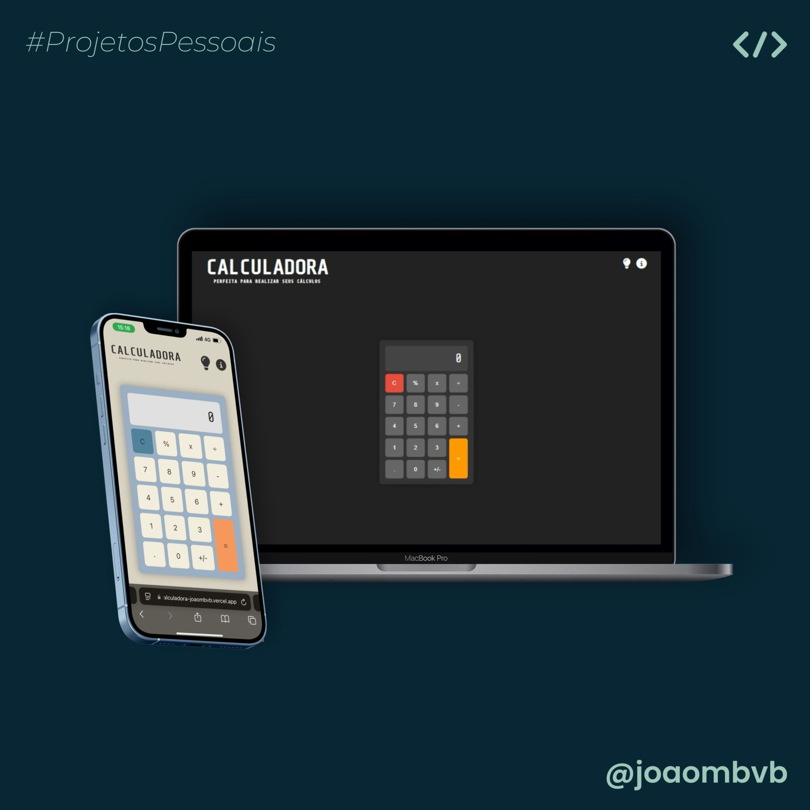

# Calculadora JavaScript

Este é um projeto de uma calculadora desenvolvida em JavaScript, HTML e CSS, com funcionalidades para cálculos básicos e operações de porcentagem. O código está dividido em arquivos para melhor organização e manutenção.

## Preview



## Funcionalidades

- **Operações Básicas**: Adição, subtração, multiplicação e divisão.
- **Cálculo de Porcentagem**: Função para calcular porcentagens.
- **Organização de Arquivos**: As funções de cálculo e porcentagem são separadas em arquivos `calcular.js` e `porcentagem.js` para facilitar a manutenção do código.
- **Modo Escuro**: Arquivo `colorMode.js` para controle de tema claro e escuro.
- **Botão de Limpar**: Função para limpar os resultados, em `limpar.js`.
- **Interface Simples e Intuitiva**: Layout clean para fácil utilização.
- **Página Sobre**: Inclui um `about.html` para informações adicionais sobre o projeto.

## Estrutura do Projeto

- `index.html`: Estrutura HTML principal da calculadora.
- `about.html`: Página com informações sobre a calculadora e o desenvolvedor.
- `styles.css`: Estilos principais da calculadora.
- `script.js`: Arquivo principal para a manipulação da calculadora.
- `calcular.js`: Funções relacionadas aos cálculos básicos.
- `porcentagem.js`: Funções relacionadas aos cálculos de porcentagem.
- `colorMode.js`: Funções para alternar entre temas claro e escuro.
- `limpar.js`: Função para limpar os resultados da calculadora.
- `buttons.css`, `header.css`, `index-main.css`, `sobre.css`: Estilos específicos para diferentes partes da interface.

## Como Usar

1. Clone este repositório:
   ```bash
   git clone https://github.com/joaombvb/calculadora.git

2. Acesse a pasta do projeto:
   ```bash
   cd calculadora-js

3. Abra o arquivo `index.html` em seu navegador. Você também pode acessar a aplicação pelo [deploy](https://calculadora-joaombvb.vercel.app).


## Tecnologias Utilizadas

- HTML5
- CSS3
- JavaScript

## Autor

Desenvolvido por **João Marcelo Barros Vilas Boas**. Entre em contato pelo [LinkedIn](https://linkedin.com/in/joaombvb/) ou pelo e-mail: [joaombvb@gmail.com](mailto:joaombvb@gmail.com).
